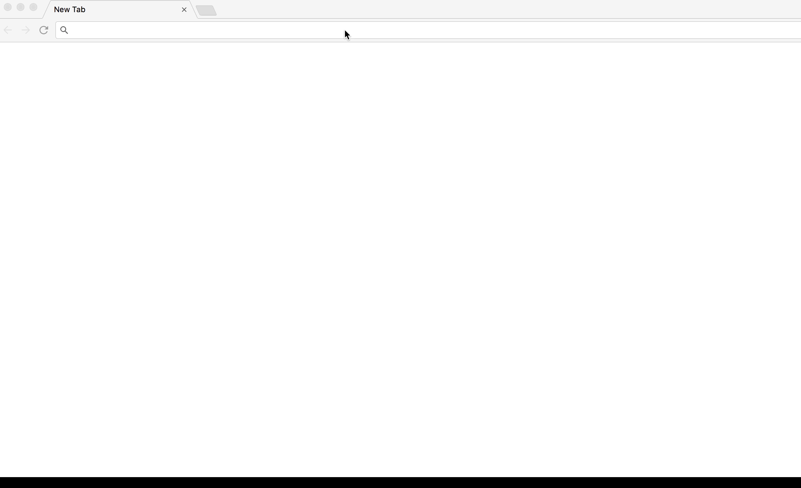

# Kubernetes + Cassandra

This sample application will walk through

* Deploying a Cassandra cluster on DC/OS
* Deploying a web application on Kubernetes, that reads/writes data in Cassandra, over the DC/OS network

## Pre-Requisites

* A DC/OS 1.10+ cluster, with at least 4 private nodes
* Kubernetes running on DC/OS
* [Configured kubectl](https://github.com/mesosphere/dcos-kubernetes-quickstart#installing-kubectl) 

## OS Detector

We are going to deploy a web application that counts the number of operating systems that visit the site.  First, deploy a 3 node Cassandra cluster onto DC/OS.

```
# TODO: CHANGE THE NAME ONCE THE NEW SDK PACKAGE GOES LIVE
dcos package install cassandra
```

We need to set up the Cassandra keyspace and table so let's start the `csql` terminal.
Deploy the following marathon app definition (e.g., using `dcos marathon app add https://raw.githubusercontent.com/mesosphere/dcos-kubernetes-quickstart/master/examples/os-detector/cassandra-cql.json`).

```json
{
  "id": "/cassandra-cql",
  "instances": 1,
  "portDefinitions": [],
  "container": {
    "type": "MESOS",
    "volumes": [],
    "docker": {
      "image": "cassandra:3.0.13"
    }
  },
  "cpus": 0.1,
  "mem": 256,
  "requirePorts": false,
  "networks": [],
  "healthChecks": [],
  "fetch": [],
  "constraints": [],
  "cmd": "while true; do sleep 1000000; done"
}
```

Next, let us connect to that container using the DC/OS CLI and connect to Cassandra:

```bash
dcos task exec -it cassandra-cql bash

cqlsh node-0-server.cassandra.autoip.dcos.thisdcos.directory
```

Once connected to Cassandra, create the keyspace and table

```
CREATE KEYSPACE browsers WITH REPLICATION = { 'class' : 'SimpleStrategy', 'replication_factor' : 1 };

CREATE TABLE browsers.browser_counts (
  counter counter,
  os varchar,
  PRIMARY KEY (os)
);
```

Now we are ready to deploy our application via Kubernetes.  The example manifest will create a deployment, as well as a `NodePort` service so we can access the application from outside the cluster.

```
kubectl create -f os-detector.yaml
```

From here, the application is deployed, and available at port `31000` on the nodes which Kubernetes is running.  Ensure your firewall is allowing traffic on that port, and you can navigate to your browser to interact with the app.


